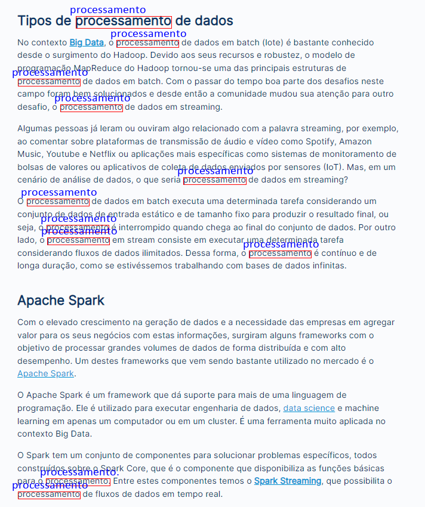

*** OCR

***INSTALAÇÃO PYTESSERACT NO SISTEMA OPERACIONAL:***
https://github.com/tesseract-ocr/tessdoc/blob/main/Installation.md

***INSTALAÇÃO DE IDIOMAS NO WINDOWS:***

# Realizar download no repósitório > https://github.com/tesseract-ocr/tessdata
# Colar no diretório: C:\Program Files\Tesseract-OCR (pasta tessdata)

# RESULTADO DO PROJETO:

